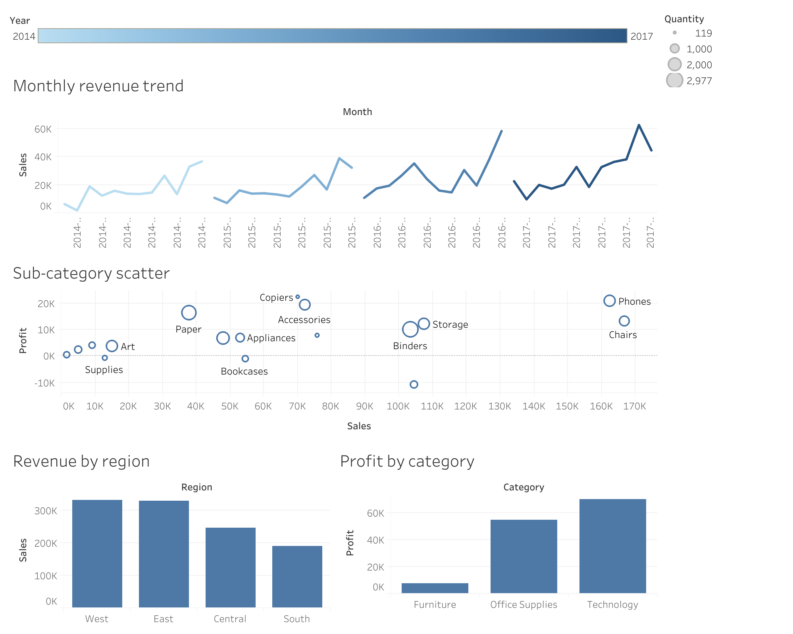
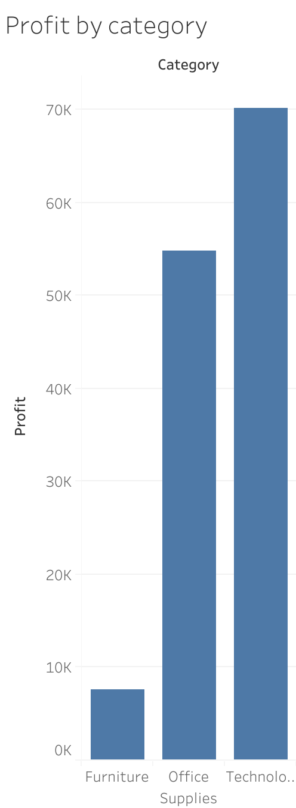
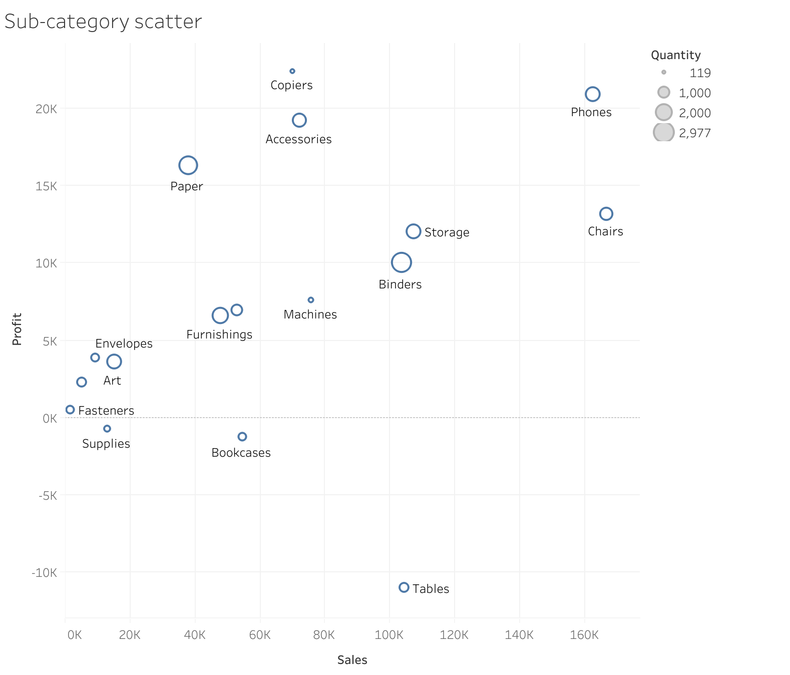

# Sales Performance Dashboard

## Overview
Analyzed 5,009 orders from a retail superstore (2014–2017) 
to identify revenue drivers, profit trends, and margin risks 
across regions and product categories.

## Business Question
Which regions, categories and sub-categories are driving 
revenue and profit — and where are the biggest margin risks?

## Dataset
- Source: Superstore Sales Dataset (Kaggle)
- 5,009 unique orders | 2014–2017 | 21 columns
- Link: kaggle.com/datasets/vivek468/superstore-dataset-final

## Tools Used
- Python (Pandas) — data cleaning and KPI calculation
- Jupyter Notebook — analysis environment
- Tableau Public — interactive dashboard
- Git & GitHub — version control

## Key Findings
1. Total revenue of $1.1M across 4 years with an average 
   profit margin of only 11.9% — indicating a thin-margin 
   business vulnerable to discounting
2. West region generates the highest revenue but margin 
   varies significantly across regions
3. Technology drives the strongest profit despite fewer orders
4. Furniture is a major revenue category but runs at very 
   low profit — Bookcases, Supplies and Tables all operate 
   at negative profit margins, losing money on every sale
5. Q4 consistently spikes — seasonal demand is a reliable 
   pattern across all 4 years

## Recommendations
1. Review discounting strategy on Furniture immediately — 
   Bookcases, Tables and Supplies are all profit-negative
2. Shift marketing focus toward Technology products which 
   deliver the strongest margin per order
3. Plan inventory and staffing around Q4 demand spike which 
   accounts for a disproportionate share of annual revenue

## Dashboard
View the live interactive dashboard on Tableau Public:
https://public.tableau.com/app/profile/varna.gobbur/viz/Salesperformancedashboard-superstore/Salesperformancedashboard 

## Project Structure
sales-dashboard/
│   ├── Superstore.csv          ← raw data (source file)
│   |── sales_clean.csv         ← cleaned output
│   |── sales_analysis.ipynb    ← full analysis notebook
│   ├── monthly_sales.csv
│   ├── region_summary.csv
│   └── category_summary.csv
└── README.md

## How to Run
1. Clone this repository
2. Install dependencies:
   pip3 install pandas matplotlib jupyter
3. Open the notebook:
   jupyter notebook notebooks/sales_analysis.ipynb
4. Run all cells in order

## Skills Demonstrated
- Data cleaning and validation with Pandas
- KPI calculation and business metric design
- Exploratory data analysis (EDA)
- Data visualization and dashboard design in Tableau
- Business insight communication and recommendations

 ## Dashboard Preview

